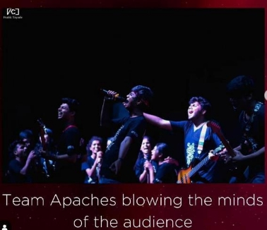

---
published: true
layout: post
author: Siddhi Shinde
categories:
  - Life
image: assets/images/cp.jpg
featured: true
---
***My First Year of Engineering*** 

I am Siddhi, a simple individual with no grand aspirations, content in the pursuit of a peaceful and unassuming life. In the beginning, I never found myself deeply passionate about any particular field. Life was sailing smoothly, until one day, I found myself stepping into the world of engineering, at a college that was quite a distance from my home. 

Engineering was never a path I had actively chosen. I had never envisioned becoming an engineer who would change the world, or a doctor dedicating half their life to mastering the intricacies of medicine. I wasn't particularly athletic enough to forge a career in sports, nor did I possess the artistic talents to captivate people through my creative works. Much like many of us, I was guided by the counsel of a cousin who suggested that engineering could be my path. 

Given that many of my cousins had found success, both financially and socially, by pursuing engineering, my parents too saw this as a promising choice. In all humility, I accepted this advice, not having any particular reason to decline it. And so it was that I embarked on this unexpected journey, stepping into the world of engineering with an open heart and a willingness to explore the unknown. 

- **The College Admission Journey: A Path to Vidyalankar Institute of Technology** 

The college admission process kicked off with a daunting schedule, full of forms to fill out, and choices to make. Amidst it all, I had a certain assurance in my heart - I was destined to secure a place at Vidyalankar Institute of Technology. My confidence stemmed from diligent calculations and thorough research. 

As the results rolled in, I was thrilled to find myself in the IT department after the very first round. To be honest, it wasn't all that surprising;  

- **The First Day of College: A Journey into the Unknown** 

On a crisp morning of November 7th (if my memory serves right), I arrived at the college after a two- hour commute, accompanied by a friend from the admission process. The 'corona batch,' with most of our 11th and half of 12th grade spent in lockdown, had yet to experience typical college life. Navigating the complex local train system added to the day's challenges. After getting lost in the confusing floors and peculiar architecture, we finally found our classroom. Feeling a bit awkward sitting at the front since all the back seats were taken, we began the day with introductions and icebreaker games. As the day concluded, we exchanged numbers and left for our homes.” 

- **Time to Settle in: Induction Activities and the Realities of Commuting** The initial days were filled with induction activities designed to help us get comfortable with our fellow students and the curriculum. While it was a good way to break the ice, at the time, it seemed like a bit of a waste to spend two hours commuting just for yoga and fun games. Little did I realize the significance of these early activities until I reflected on them later. 

  The real challenge, it turns out, was time management. I had never travelled so extensively in a single day, and the four-hour daily commute was starting to take its toll. What didn't feel like a big deal before college suddenly became quite burdensome in just a matter of days. It dawned on me that effective time management was not just a suggestion; it was a necessity to survive the demanding college life. An essential lesson learned." 

- **A Few Weeks in Mid-Semester Exams and the Anticipation of Fresher’s Week**

After a few weeks, the mid-semester exams began, and things were going reasonably well. The autonomy we had was like a breath of fresh air, setting us apart from my friends in other colleges. Everyone was eagerly awaiting the fresher’s party, a much-anticipated event.  

During this time, some sporting events took place, and many of our classmates performed remarkably. I, on the other hand, was still in the process of breaking the ice and finding my footing in this new environment. 

Then came the Fresher’s Week, and it started with a bang. 'ILLUSION' was the theme, and I was genuinely looking forward to it. I had never attended a party before, let alone a college party, so it felt like quite a big deal. These events play a crucial role in making friends and establishing connections. I was eager to blend in, even though it was a bit challenging. Nevertheless, I realized that it wasn't the only opportunity to do so. The Fresher’s Party turned out to be a memorable event, with many showcasing their talents and the opportunity to meet new people. 

Regrettably, I didn't participate in any of the events during Fresher’s Week. Looking back, I can't help but feel a bit disappointed. Witnessing people forming extensive networks of friends, classmates, and relationships was indeed an eye-opening experience. It made me realize the value of seizing opportunities to connect and engage in the college community." 

You're right. While missing out on events like Fresher’s Week was a bit disappointing, it's not the end of the world. Building connections and friendships can happen in various settings, like daily lectures and project groups. You don't necessarily need a special event or stage for that. 

People often emphasize the importance of making friends and engaging with others, and I wholeheartedly agree. Being social is a fundamental aspect of human nature, and we can't thrive in isolation. Even if you consider yourself an introvert or are comfortable with your own company, you can't escape the need for communication and connection. It's an essential part of life. 

I'm still working on improving my communication skills, and it's never too late to start doing the same.  
